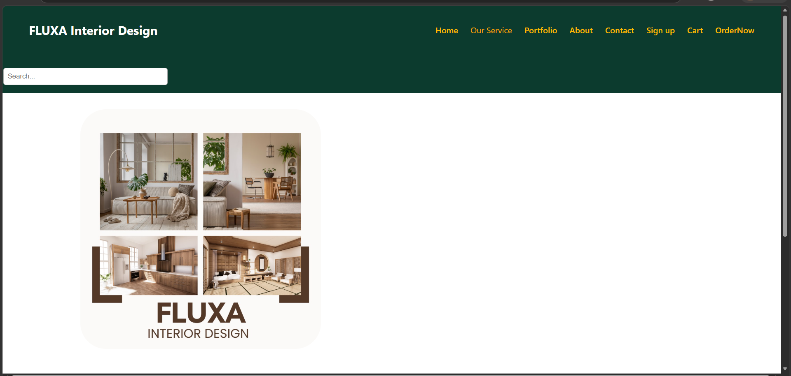
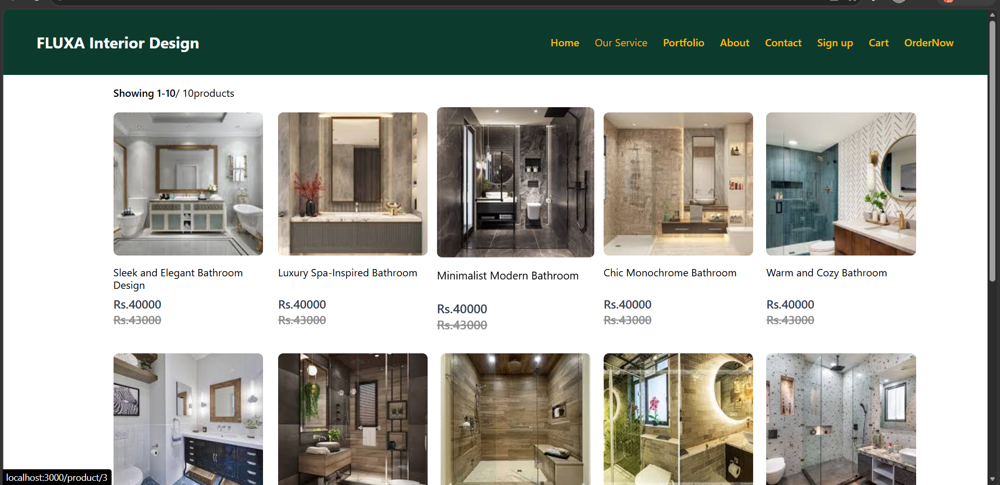
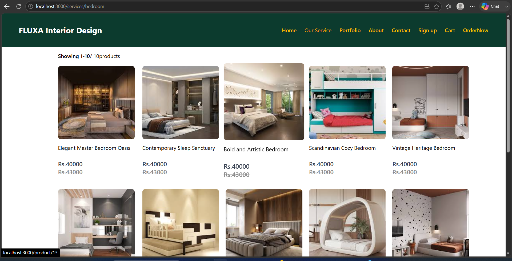
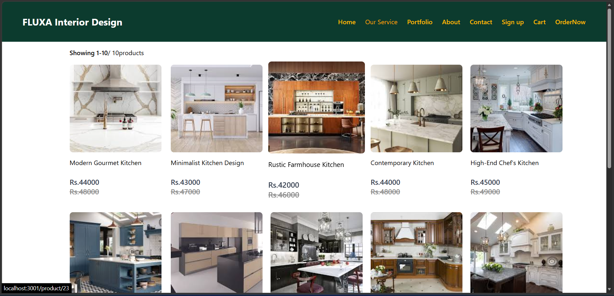
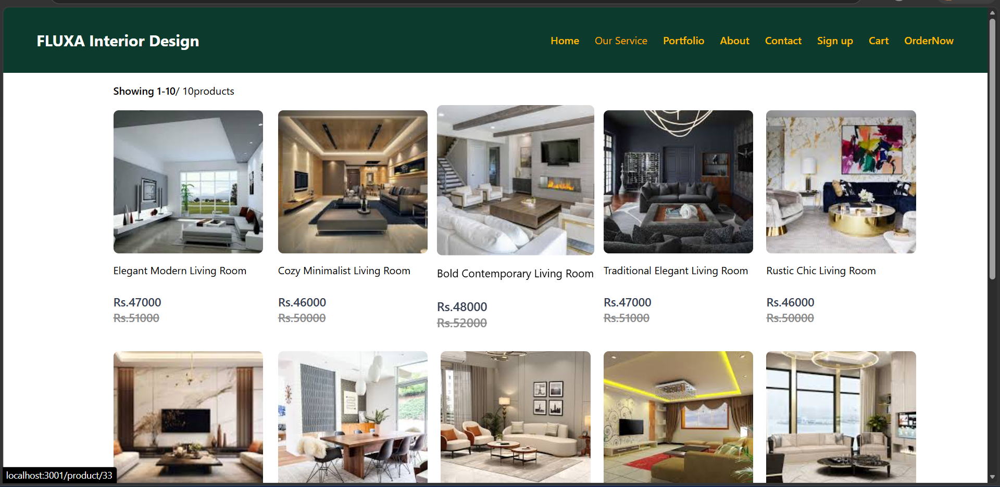
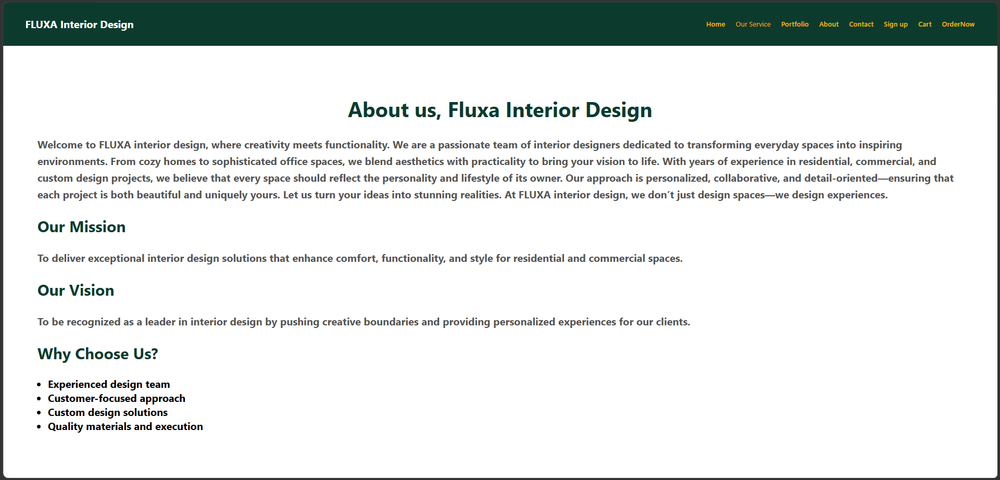
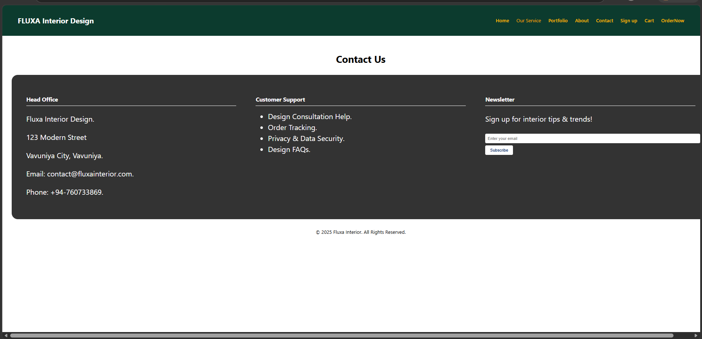
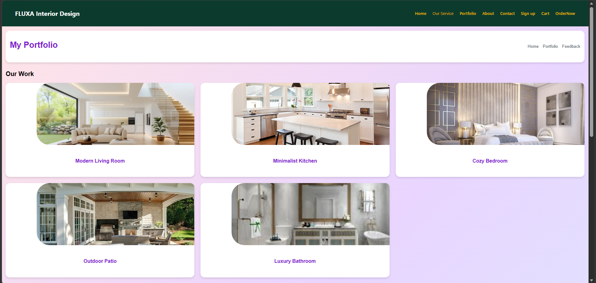
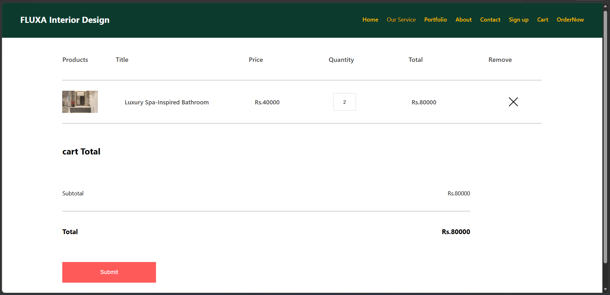
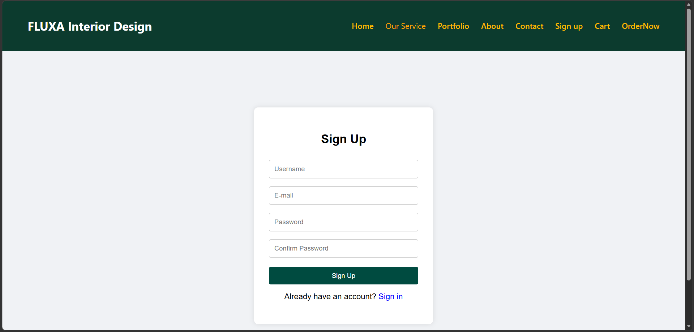

# Interior Design

A modern and responsive **Interior Design Frontend** built with **React.js**. This project provides users with an interactive platform to explore interior design collections, browse different room categories, view design details, explore services, and manage selected products through a shopping cart.

## 🌐 Project Overview

**Interior Design** is a frontend web application developed using React.js to provide users with a modern and user-friendly experience for exploring interior design and home decor solutions.

The application includes different interior design categories such as **Bathroom, Bedroom, Kitchen, and Living Room**, along with pages for **Home, About Us, Contact, Portfolio, Services, Product Details, Cart, and User Signup**.

The project uses reusable React components, React Router for navigation, and React Context API for managing application state.

## ✨ Features

* 🏠 Modern and responsive Home page
* 🎨 Interior design and home decor showcase
* 🚿 Bathroom design collection
* 🛏️ Bedroom design collection
* 🍳 Kitchen design collection
* 🛋️ Living Room design collection
* 🖼️ Portfolio section
* 💼 About Us page
* 📞 Contact Us page
* 💡 Interior design services section
* 🔍 Product and design details
* 🛒 Shopping cart functionality
* 🔐 Signup interface
* ⭐ Product rating display
* 🔗 Related products section
* 🧭 Breadcrumb navigation
* 📱 Responsive user interface
* ♻️ Reusable React components
* ⚡ React Context API for state management
* 🔄 Client-side navigation using React Router

## 🛠️ Technologies Used

* **React.js**
* **JavaScript**
* **HTML5**
* **CSS3**
* **React Router DOM**
* **React Context API**
* **Create React App**
* **Git**
* **GitHub**

## 📂 Project Structure

```text
interior-design/
│
├── public/
│
├── screenshots/
│   ├── about.png
│   ├── bathroom_designs.png
│   ├── bedroom_designs.png
│   ├── cart.png
│   ├── contact.png
│   ├── home.png
│   ├── kitchen_designs.png
│   ├── livingroom_designs.png
│   ├── portfolio.png
│   └── signup.png
│
├── src/
│   ├── Components/
│   │   ├── Assets/
│   │   ├── Breadcrums/
│   │   ├── CartItem/
│   │   ├── DescriptionBox/
│   │   ├── Hero/
│   │   ├── Item/
│   │   ├── Navbar/
│   │   ├── Offers/
│   │   ├── Popular/
│   │   ├── ProductDisplay/
│   │   └── RelatedProducts/
│   │
│   ├── Context/
│   │
│   ├── Ourservices/
│   │
│   ├── pages/
│   │
│   ├── App.css
│   ├── App.js
│   ├── index.css
│   └── index.js
│
├── .gitignore
├── package.json
├── package-lock.json
└── README.md
```

## 📄 Main Pages and Sections

### 🏠 Home

The Home page introduces the interior design platform and showcases featured interior design collections and products.

### 🚿 Bathroom Designs

Allows users to explore interior design ideas and collections focused on bathroom spaces.

### 🛏️ Bedroom Designs

Displays bedroom interior design collections and ideas for creating comfortable and stylish spaces.

### 🍳 Kitchen Designs

Provides a collection of kitchen interior designs and home decor ideas.

### 🛋️ Living Room Designs

Showcases living room interior designs and decoration concepts.

### 💼 About Us

Provides information about the interior design platform and its purpose.

### 📞 Contact Us

Provides a contact interface for users who want to communicate or make inquiries.

### 🖼️ Portfolio

Showcases interior design work and design concepts.

### 💡 Our Services

Presents the interior design services provided by the platform.

### 🛒 Shopping Cart

Allows users to view and manage selected products.

### 🔐 Signup

Provides a user signup interface for creating an account.

## 📸 Screenshots

### 🏠 Home Page



### 🚿 Bathroom Designs



### 🛏️ Bedroom Designs



### 🍳 Kitchen Designs



### 🛋️ Living Room Designs



### 💼 About Us



### 📞 Contact Us



### 🖼️ Portfolio



### 🛒 Shopping Cart



### 🔐 Signup



## ⚙️ Getting Started

### Prerequisites

Make sure you have the following installed:

* Node.js
* npm
* Git

### 1. Clone the Repository

```bash
git clone https://github.com/thasneem-mfm/interior-design.git
```

### 2. Navigate to the Project Directory

```bash
cd interior-design
```

### 3. Install Dependencies

```bash
npm install
```

### 4. Start the Development Server

```bash
npm start
```

The application will run at:

```text
http://localhost:3000
```

## 📦 Available Scripts

### Start Development Server

```bash
npm start
```

Runs the application in development mode.

### Create Production Build

```bash
npm run build
```

Creates an optimized production build of the application.

### Run Tests

```bash
npm test
```

Runs the project's test suite.

## 🚀 Future Improvements

* 🔗 Backend API integration
* 🗄️ Database integration
* 🔐 Complete user authentication and authorization
* 💳 Online payment gateway integration
* 👨‍💼 Admin dashboard
* 📦 Product and inventory management
* 🛍️ Order management system
* 👤 User profile management
* 📧 Email notification system
* 🚀 Deployment to a production environment

## 📌 Project Status

**Frontend Development – In Progress**

The current version focuses on the React.js frontend implementation, user interface, product presentation, navigation, and shopping cart functionality. Backend integration, database connectivity, authentication, payment integration, and additional e-commerce features are planned for future development.

## 👨‍💻 Developer

**Mohamed Thasneem**

GitHub: **thasneem-mfm**

## 📄 License

This project was developed for learning, academic, and portfolio purposes.
